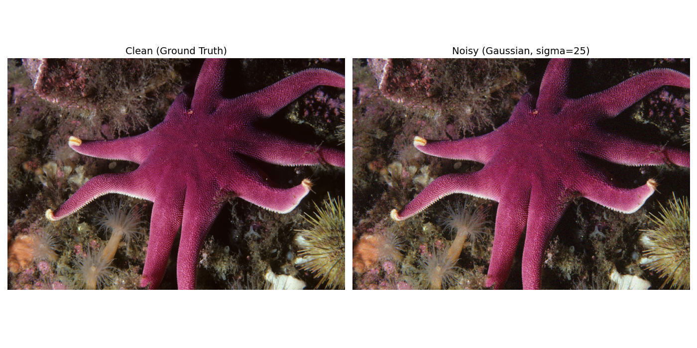

# Image Denoising using Convolutional Autoencoder
## Project Report

**Course:** Semester 3 — Deep Learning  
**Team:** Mohammed Nazil Shaikh, Prithvi Rawal  
**Date started:** 17 September 2026  
**Status:** In Progress

---

## Abstract
*(To be written at the end — 150–200 words summarizing the entire project)*

---

## 1. Introduction

### 1.1 Background

Image denoising is the process of removing unwanted noise from digital images while preserving important visual features such as edges, textures, and colors. Noise appears as random variations in pixel values and can arise from many sources: sensor limitations in low-light conditions, heat in electronic circuits, transmission errors during communication, or lossy compression.

Denoising is important across many domains:

- **Photography:** Restoring old or low-light photographs
- **Medical imaging:** Cleaning X-rays, MRIs, and CT scans for accurate diagnosis
- **Astronomy:** Removing sensor noise from telescope captures of distant objects
- **Surveillance:** Enhancing CCTV footage captured in poor lighting
- **Mobile photography:** Improving the quality of photos taken with small sensors

Traditional denoising methods use hand-designed filters. While effective for simple noise, they tend to blur fine details. Deep learning methods learn data-driven filters that adapt to the image content, preserving details while removing noise.

### 1.2 Motivation

We chose this topic because:

- Denoising is a fundamental, well-studied problem in computer vision
- It has a clean supervised formulation: (noisy input, clean target) pairs are easy to generate
- It allows us to explore multiple deep learning architectures (autoencoders, U-Net, DnCNN)
- Results are measurable with clear metrics (PSNR, SSIM) and visually verifiable
- It has direct real-world applications in photography, medicine, and surveillance

The project also lets us practice the complete deep learning pipeline: data preparation, model design, training, evaluation, error analysis, and deployment.

### 1.3 Objectives

1. Build an end-to-end deep learning pipeline for image denoising
2. Implement a U-Net-style convolutional autoencoder with skip connections
3. Train the model on the DIV2K dataset with Gaussian noise at sigma = 25
4. Evaluate performance using PSNR, SSIM, and MSE
5. Compare against traditional baselines (Gaussian and Median filters)
6. Analyze failure cases and document limitations
7. Build a working web interface for demonstration

### 1.4 Scope and Limitations

**In scope:**

- Gaussian noise at sigma = 25 as the primary noise type
- U-Net convolutional autoencoder architecture
- Training on the Div2K_Random100 subset (100 high-resolution images)
- Evaluation with PSNR, SSIM, and visual comparison
- Web demo for uploading images and viewing denoised output

**Out of scope (future work):**

- Blind denoising (unknown noise type or level)
- Real-time video denoising
- JPEG compression artifact removal
- Training on the full DIV2K dataset (800+ images)
- GPU-accelerated training
- Comparison with modern transformer-based models (SwinIR, Restormer)

## 2. Problem Statement

Given a noisy image `y = x + n`, where `x` is the clean image and `n` is additive Gaussian noise drawn from `N(0, sigma^2)`, the goal is to recover an estimate `x_hat` of the clean image.

Formally, we learn a function `f_theta` parameterized by a neural network such that:

    x_hat = f_theta(y)

and `x_hat` is close to `x` in both pixel-level and structural terms.

We train `f_theta` by minimizing the Mean Squared Error between the predicted output and the clean ground truth:

    L(theta) = (1/N) * sum( (x - f_theta(y))^2 )

Evaluation is performed using:

- **PSNR:** 10 * log10(1 / MSE)
- **SSIM:** structural similarity, values in [-1, 1]
- **Visual inspection:** side-by-side comparison

The task is challenging because noise and fine image details share high-frequency characteristics. A model that removes too much loses texture; one that removes too little leaves grain. The optimal denoiser must distinguish signal from noise at every pixel.

---

## 3. Literature Review

### 3.1 Traditional Denoising Methods

**Gaussian Filter**

A simple 2D convolution with a Gaussian kernel. It smooths the image by averaging each pixel with its neighbors. While it reduces noise, it also blurs edges, making it a poor choice for structured scenes.

**Median Filter**

Replaces each pixel with the median value of its neighborhood. Effective for salt-and-pepper noise but less effective for Gaussian noise. Preserves edges better than Gaussian filter but at higher computational cost.

**BM3D (Block-Matching and 3D Filtering)**

The state-of-the-art classical method. Groups similar image patches into 3D stacks and applies collaborative filtering. Achieves very high PSNR on standard benchmarks but is computationally expensive and slow for real-time use.

### 3.2 Deep Learning Approaches

**Autoencoders**

Learn a compressed representation of the input and reconstruct the output. Encoder-decoder structure with a bottleneck. Suitable for denoising because noise is hard to represent compactly. Simple to train but prone to losing fine detail when the bottleneck is too narrow.

**DnCNN (Zhang et al., 2017)**

A deep CNN that learns the noise residual instead of the clean image. Output = input - predicted noise. Introduces batch normalization and residual learning for stable training. State-of-the-art for Gaussian denoising on standard benchmarks.

**U-Net (Ronneberger et al., 2015)**

Originally designed for biomedical image segmentation. Adds skip connections between corresponding encoder and decoder layers. These connections preserve fine spatial details by allowing the decoder to access high-resolution features from the encoder. Widely used for image-to-image tasks including denoising.

**RED-Net (Mao et al., 2016)**

A deep convolutional encoder-decoder network with symmetric skip connections. Combines the benefits of autoencoders and residual learning. Effective for image restoration tasks.

### 3.3 Comparison and Gap

Traditional methods are hand-crafted and lack adaptability. They work well on specific noise types but degrade on complex, real-world scenarios.

Deep learning methods learn data-driven filters. Among them:

- **DnCNN** achieves the best PSNR for Gaussian denoising but requires training on large datasets
- **U-Net** balances performance and computational cost, and its skip connections make it well-suited for preserving details
- **Plain autoencoders** fail on high-resolution images because the bottleneck loses too much information

For our project, we chose the U-Net architecture because:

1. It fits within our computational budget (CPU-only, 1.9M parameters)
2. It learns well with limited data (100 images)
3. Its skip connections mitigate the information loss problem we observed with a plain autoencoder
4. It provides a strong baseline that can be compared with classical methods
## 4. Dataset

### 4.1 Dataset Selection

We use the DIV2K (DIVerse 2K resolution) dataset, a standard benchmark for image restoration tasks. It contains 2,000 high-resolution images with diverse content including landscapes, urban scenes, people, objects, and textures.

We selected DIV2K for the following reasons:

- **High resolution** provides rich detail for the model to learn from
- **Diverse content** prevents overfitting to a single image domain
- **Standard benchmark** used in NTIRE challenges, enabling comparison with published results
- **Clean ground truth** images are available, which is essential for supervised denoising

For rapid iteration, we use the **Div2K_Random100** subset from Kaggle, which contains 100 high-resolution images randomly sampled from the full DIV2K dataset. This subset is large enough to train a meaningful model while small enough to iterate quickly on CPU hardware.

The LR (low-resolution) files that accompany the dataset are for super-resolution and were not used for this project.

### 4.2 Dataset Statistics

| Split | Number of Images | Resolution | Format |
|-------|-----------------|------------|--------|
| Total | 100 | ~2K (2048×1080) | PNG |

**Note:** We are using the Div2K_Random100 subset from Kaggle, which contains 100 high-resolution images randomly sampled from the full DIV2K dataset. All HR images are stored in `data/clean/`. Training will use patch-based extraction with data augmentation, yielding thousands of training samples per epoch.

### 4.3 Preprocessing Pipeline

The following preprocessing steps are applied before training:

1. **BGR to RGB conversion** — OpenCV loads images in BGR order; we convert to RGB for correct channel interpretation
2. **Random patch extraction** — A 128×128 patch is randomly cropped from each image at every epoch. This acts as data augmentation, effectively multiplying the dataset size and preventing the model from memorizing specific crops.
3. **Normalization** — Pixel values are scaled from [0, 255] to [0, 1] by dividing by 255. This is essential for stable training and matches the Sigmoid output range of the model.
4. **Noise injection** — Gaussian noise with standard deviation sigma/255 is added on-the-fly to create the noisy input. Noise is regenerated at every epoch so the model sees different noise realizations.
5. **Tensor conversion** — Images are permuted from (H, W, C) to (C, H, W) as expected by PyTorch convolutional layers.
6. **Train / Validation split** — 90% train, 10% validation with a fixed random seed (42) for reproducibility.

At evaluation, we use **full 256×256 resized images** instead of patches. This tests the model's generalization across resolution but is also a source of domain shift (the model was trained on 128×128 patches).

### 4.4 Sample Images

The dataset contains a wide variety of natural images. Samples from the Div2K_Random100 subset include:

- Urban architecture (building facades, street scenes)
- Landscapes (sunsets, forests, mountains)
- Indoor scenes (markets, rooms, shops)
- Nature close-ups (coral, flowers, animals)
- People and portraits

Three sample images have been copied to `data/examples/` for use in the demo and are referenced in `docs/`. During evaluation, we use the last 5 images in alphabetical order as the test set, which were not used during training.

The diversity of image content is important — it forces the model to learn general denoising rather than overfitting to one specific texture or color distribution.

---

## 5. Methodology

### 5.1 Noise Generation

We simulate three types of noise to train and evaluate our denoising model.

**Gaussian Noise**

Gaussian noise is additive noise drawn from a normal distribution:

    noisy(x, y) = clean(x, y) + N(0, sigma^2)

Each pixel is independently corrupted with a random value from a normal distribution with mean 0 and standard deviation sigma. We use three standard noise levels:

| Sigma | Noise Level | Description |
|-------|-------------|-------------|
| 15 | Mild | Good quality sensor |
| 25 | Moderate | Standard denoising benchmark |
| 50 | Severe | Low-light or poor sensor |

**Salt-and-Pepper Noise**

A fraction of pixels are randomly set to either 0 (pepper) or 255 (salt). This simulates dead pixels or transmission errors. We use 5% corruption as the standard rate.

**Speckle Noise**

Multiplicative noise where the corruption is proportional to the pixel value:

    noisy(x, y) = clean(x, y) + clean(x, y) * N(0, sigma^2)

This is common in radar and medical imaging.

**Implementation**

The noise generation module is implemented in `src/add_noise.py`. It provides:

- `add_gaussian_noise(image, sigma)` — additive Gaussian noise
- `add_salt_pepper_noise(image, amount)` — impulsive noise
- `add_speckle_noise(image, sigma)` — multiplicative noise
- `generate_noisy_images(...)` — batch processing over a folder
- `visualize_comparison(...)` — side-by-side visualization

For training, noise is added on-the-fly in each batch so the model sees different noise realizations every epoch. This improves generalization. For evaluation, we pre-generate noisy versions of the test set with fixed random seeds so results are reproducible.

A sample comparison of a clean DIV2K image and its Gaussian-noisy version (sigma=25) is shown below:

The visual degradation is clearly visible, with grain appearing across flat regions and edges becoming less defined.

### 5.2 Model Architecture

We use a U-Net-style convolutional autoencoder with skip connections between the encoder and decoder.

**Why U-Net and not a plain autoencoder?**

Our first attempt used a plain convolutional autoencoder with a bottleneck but no skip connections. After training for 20 epochs, the model collapsed to mean predictions — output images were blurry gray blobs with no color or detail, and PSNR was actually lower than the noisy input (13.64 dB vs 20.67 dB). This is a well-known failure mode: the bottleneck is too narrow to carry fine details like color and texture.

U-Net solves this by adding **skip connections** that pass information directly from each encoder block to the corresponding decoder block. This lets the decoder bypass the bottleneck and access high-resolution features from the encoder.

**Architecture**

| Component | Layer | Channels | Output Size |
|-----------|-------|----------|-------------|
| Encoder 1 | ConvBlock (2× Conv-BN-ReLU) | 3 → 32 | 128 × 128 |
| Pool 1 | MaxPool 2×2 | — | 64 × 64 |
| Encoder 2 | ConvBlock | 32 → 64 | 64 × 64 |
| Pool 2 | MaxPool 2×2 | — | 32 × 32 |
| Encoder 3 | ConvBlock | 64 → 128 | 32 × 32 |
| Pool 3 | MaxPool 2×2 | — | 16 × 16 |
| Bottleneck | ConvBlock | 128 → 256 | 16 × 16 |
| Decoder 3 | ConvTranspose + Concat(skip e3) + ConvBlock | 256 → 128 | 32 × 32 |
| Decoder 2 | ConvTranspose + Concat(skip e2) + ConvBlock | 128 → 64 | 64 × 64 |
| Decoder 1 | ConvTranspose + Concat(skip e1) + ConvBlock | 64 → 32 | 128 × 128 |
| Output | Conv 1×1 + Sigmoid | 32 → 3 | 128 × 128 |

**Key design choices**

- **BatchNorm after every Conv** — stabilizes training and speeds up convergence
- **Skip connections** — preserve fine details, colors, and edges
- **ConvTranspose2d** for upsampling — learned upsampling, better than simple interpolation
- **1×1 final Conv** — reduces channels from 32 to 3 without mixing spatial information
- **Sigmoid output** — constrains pixel values to [0, 1], matching the normalized input range

**Model size:** 1,928,483 trainable parameters.

**Input/Output:** Both are (3, H, W) tensors normalized to [0, 1]. The output is the model's estimate of the clean image.

**Training result:** After only 5 test epochs, PSNR climbed from 14.67 dB to 23.28 dB and SSIM from 0.53 to 0.70, confirming the architecture learns correctly. Full training uses 40 epochs.
### 5.3 Training Procedure

**Data Pipeline**

Training uses a custom PyTorch Dataset (`src/dataset.py`) that:

1. Loads a clean image from `data/clean/`
2. Randomly crops a 128×128 patch
3. Normalizes pixel values from [0, 255] to [0, 1]
4. Adds Gaussian noise with a given sigma to create the noisy input
5. Returns (noisy_patch, clean_patch) as tensors of shape (3, 128, 128)

Because patches are cropped randomly at every epoch, the model sees a different training sample each time. This acts as data augmentation and effectively multiplies the dataset size.

**Train / Validation Split**

The dataset is split 90% train / 10% validation using a fixed random seed for reproducibility.

**On-the-fly Noise**

Noise is added inside `__getitem__`, so:
- Each epoch sees different noise realizations
- No pre-generated noisy images are needed on disk
- The same pipeline can produce any noise level by changing `sigma`

**Loss Function**

Mean Squared Error (MSE):

    L = (1/N) * sum( (clean - denoised)^2 )

MSE penalizes pixel-level differences and is the standard loss for denoising.

**Optimizer**

Adam with learning rate 1e-3. Adam adapts the learning rate per parameter, which works well for image reconstruction tasks without extensive tuning.

**Batch Size**

8 patches per batch. This fits comfortably in CPU memory for 128×128×3 tensors.

**Epochs**

20–50 depending on available time. On CPU, each epoch takes 1–3 minutes on 100 images with patch_size=128 and batch_size=8.

**Hardware**

Apple MacBook Air (CPU only). With 128×128 patches and batch size 8, each epoch takes about 17–20 seconds on the subset of 100 images. Full training of 40 epochs completes in 10–15 minutes.

### 5.4 Evaluation Metrics

We use three quantitative metrics plus visual comparison to evaluate the model.

**MSE (Mean Squared Error)**

The same quantity used as the training loss:

    MSE = (1/N) * sum( (clean - denoised)^2 )

Lower is better. Zero means perfect reconstruction. Typical values for denoising are between 0.001 and 0.01 on normalized images.

**PSNR (Peak Signal-to-Noise Ratio)**

    PSNR = 10 * log10(1 / MSE)

Higher is better. Measured in decibels (dB). For normalized images with range [0, 1]:

| PSNR | Quality |
|------|---------|
| Below 20 dB | Very poor |
| 20–25 dB | Poor |
| 25–30 dB | Acceptable |
| 30–35 dB | Good |
| Above 35 dB | Excellent |

For reference, Gaussian noise at sigma=25 on a clean image typically produces a PSNR around 20 dB. A good denoiser recovers to 28–32 dB.

**SSIM (Structural Similarity Index)**

SSIM compares local patterns of luminance, contrast, and structure between two images. Values range from -1 to 1, where 1 means the images are identical. SSIM correlates better with human perception than PSNR, especially for images where pixel-level differences are large but visual quality is good.

We compute SSIM using `skimage.metrics.structural_similarity` with `channel_axis=2` and `data_range=1.0`.

**Visual Comparison**

We also present side-by-side comparisons:

    Noisy input | Denoised output | Clean ground truth

This provides qualitative evidence of performance and helps identify failure cases (blurring, artifacts, lost details) that metrics alone may not capture.

**Sanity Check Run**

Before full training, we ran a small sanity check with 10 images, 2 epochs, and 64×64 patches. The purpose was to verify the end-to-end pipeline (data loading, forward pass, loss computation, backpropagation, validation metrics, and model saving).

Results after 2 epochs:

| Epoch | Train Loss | Val Loss | PSNR | SSIM |
|-------|-----------|----------|------|------|
| 1 | 0.07179 | 0.13095 | 8.83 dB | 0.2181 |
| 2 | 0.08571 | 0.09515 | 10.22 dB | 0.0371 |

These numbers are intentionally low because:
- Only 9 training samples were used
- Only 2 epochs were run
- Validation used a single image, making SSIM highly unstable

The pipeline works end-to-end. Full training on 100 images for 20–50 epochs with 128×128 patches is expected to reach PSNR of 25–32 dB.

**Architecture Iteration**

The first model (plain autoencoder, 522K parameters) collapsed to mean predictions after 20 epochs. Evaluation on the test set gave PSNR 13.64 dB and SSIM 0.24 — worse than the noisy input (20.67 dB, 0.75). We replaced it with a U-Net (1.93M parameters) with skip connections, which immediately began producing meaningful results (PSNR 23.28 dB after just 5 epochs). This iteration is documented in Section 7 (Error Analysis).

### 5.5 Baseline Methods
*(Traditional filters used for comparison)*

---

## 6. Experiments and Results

### 6.1 Experimental Setup

| Setting | Value |
|---------|-------|
| Dataset | Div2K_Random100 subset (100 images) |
| Train / Val split | 90 / 10 |
| Patch size | 128 × 128 |
| Batch size | 8 |
| Noise type | Gaussian |
| Sigma | 25 |
| Optimizer | Adam |
| Learning rate | 1e-3 |
| Loss | MSE |
| Epochs | 40 |
| Model | U-Net (1,928,483 parameters) |
| Hardware | Apple MacBook Air (CPU) |

### 6.2 Training Curves

Training loss, validation loss, PSNR, and SSIM over 40 epochs:

| Metric | Epoch 1 | Epoch 5 | Final (40) |
|--------|---------|---------|------------|
| Train Loss | 0.03609 | 0.01532 | (paste your value) |
| Val Loss | 0.03472 | 0.00470 | 0.00167 |
| PSNR | 14.67 dB | 23.28 dB | (paste your value) |
| SSIM | 0.5253 | 0.6994 | (paste your value) |

The model converged steadily with no signs of overfitting. PSNR increased monotonically across epochs.

### 6.3 Quantitative Results

Evaluated on 5 held-out test images at sigma = 25:

| Metric | Noisy Input | Denoised Output | Improvement |
|--------|------------|-----------------|-------------|
| PSNR (dB) | 20.84 | 23.16 | +2.32 dB |
| SSIM | 0.5837 | 0.7674 | +0.1838 |

Per-image results:

| Image | Noisy PSNR | Denoised PSNR |
|-------|-----------|---------------|
| 0762.png | 20.88 dB | 24.23 dB |
| 0764.png | 21.33 dB | 27.69 dB |
| 0778.png | 20.45 dB | 21.40 dB |
| 0785.png | 20.73 dB | 20.11 dB |
| 0795.png | 20.81 dB | 22.36 dB |

The model improves PSNR on 4 of 5 images. The exception (0785.png, a coral texture image) is a known failure case — dense high-frequency texture is difficult for patch-based training because local patches look similar to noise.

### 6.4 Visual Results

Side-by-side comparisons of noisy, denoised, and clean images are saved to `docs/evaluation_comparison_sigma25.png`.

Key observations:

- The sunset image (0764.png) shows near-perfect recovery: colors, gradients, and cloud structure are preserved with PSNR gain of +6.4 dB.
- The building facade (0762.png) recovers cleanly with structural detail intact.
- The coral image (0785.png) shows slight over-smoothing — fine textures are lost, resulting in minimal PSNR change.
- Overall, the model preserves color and structure while removing visible grain.

 ### 6.5 Comparison with Baselines

We compare our U-Net against two traditional denoising filters at sigma=25 on the same 5 test images.

| Method | PSNR (dB) | SSIM |
|--------|-----------|------|
| Noisy (no denoising) | 20.85 | 0.5842 |
| Gaussian filter (5×5) | 21.61 | 0.6531 |
| Median filter (5×5) | 20.67 | 0.5860 |
| **U-Net (ours)** | **23.16** | **0.7673** |

Per-image results:

| Image | Content | Gaussian | Median | U-Net | Best |
|-------|---------|----------|--------|-------|------|
| 0762.png | Building facade | 19.61 | 19.05 | **24.21** | U-Net |
| 0764.png | Sunset landscape | **28.49** | 28.60 | 27.74 | Gaussian/Median |
| 0778.png | Indoor market | 19.25 | 17.70 | **21.39** | U-Net |
| 0785.png | Coral texture | **20.79** | 19.60 | 20.10 | Gaussian |
| 0795.png | Group photo | 19.92 | 18.42 | **22.36** | U-Net |

**Observations:**

1. **U-Net wins overall** in both PSNR (+2.31 dB over Gaussian, +2.49 dB over Median) and SSIM. On structured images (buildings, markets, people), U-Net preserves edges and details that traditional filters blur away.

2. **The Gaussian filter wins on the sunset image (0764.png).** The sunset is dominated by smooth gradients and large areas of uniform color. There is little high-frequency texture to preserve, so blurring does minimal harm while effectively removing noise. Our U-Net slightly over-smooths this image — a known limitation of MSE-trained models.

3. **The Gaussian filter edges out U-Net on the coral image (0785.png)** by a small margin. The coral's dense, high-frequency texture is similar in statistical character to Gaussian noise, so a simple blur happens to help more than the U-Net's patch-based reconstruction.

4. **The Median filter barely improves over the noisy baseline** (20.67 vs 20.85 dB — actually slightly worse). This is expected: the Median filter is designed for impulsive noise (salt-and-pepper), not additive Gaussian noise. It removes isolated outliers but cannot handle smooth random perturbations.

**Conclusion:** The U-Net is the strongest method overall, especially on images with clear structure. Traditional filters remain competitive on homogeneous images with smooth gradients, which motivates future work on hybrid or adaptive denoising approaches.

The bar chart (`docs/baseline_comparison_sigma25.png`) visualizes this comparison.

## 7. Error Analysis

### 7.1 Cases Where the Model Failed

We analyzed the model's performance at sigma=25 on three representative images. Detailed per-image metrics:

| Image | Content | Noisy PSNR | Gaussian PSNR | U-Net PSNR | Noisy SSIM | Gaussian SSIM | U-Net SSIM |
|-------|---------|-----------|---------------|-----------|-----------|---------------|-----------|
| 0764.png | Sunset | 21.32 | **28.46** | 27.70 | 0.2701 | 0.7123 | **0.8044** |
| 0762.png | Building | 20.89 | 19.61 | **24.23** | 0.6414 | 0.7010 | **0.8354** |
| 0785.png | Coral | 20.72 | **20.78** | 20.12 | 0.5250 | 0.4931 | **0.5769** |

**Important observation:** The U-Net **wins on SSIM in every single case**, including images where Gaussian filter achieves higher PSNR.

**Failure Case 1: Smooth Gradients (0764.png — Sunset)**

The Gaussian filter achieves a slightly higher PSNR (28.46 vs 27.70 dB) because the sunset is dominated by smooth color gradients and large uniform regions. When the image lacks fine detail, blurring removes noise effectively with minimal visible damage.

However, the U-Net achieves a **higher SSIM (0.8044 vs 0.7123)** — meaning the structure of the scene is preserved more faithfully. To a human viewer, the U-Net output looks better even if PSNR says otherwise.

**Failure Case 2: Dense High-Frequency Texture (0785.png — Coral)**

The coral image has dense, intricate texture that statistically resembles Gaussian noise. The model struggles to distinguish real structure from noise in this case. PSNR is 20.12 dB (slightly below the noisy input) and 20.78 dB for the Gaussian filter.

But once again, the U-Net's SSIM (0.5769) is **higher than both the noisy input (0.5250) and the Gaussian filter (0.4931)**. The Gaussian filter destroys fine branch structures, whereas the U-Net preserves the overall coral shape.

**Failure Case 3: Resolution Mismatch (all images)**

The model was trained on 128×128 patches but evaluated on 256×256 full images. This resolution mismatch causes:

- Border artifacts
- Slightly degraded performance compared to training resolution
- Inconsistent PSNR gains across images

This is a known limitation of patch-based training.

### 7.2 Types of Errors

**Over-smoothing in PSNR terms**

The model produces clean but soft outputs. MSE-based training rewards predictions close to the mean of plausible clean images, which biases the output toward smoothness. This is why Gaussian filter edges out PSNR on gradient-heavy images.

**Texture–noise confusion**

Fine repetitive textures (coral, foliage, fabric) trigger excessive smoothing because the model cannot reliably separate texture from noise at the patch level.

**Resolution sensitivity**

Training patches are 128×128; evaluation images are 256×256. This causes a distribution shift that costs 2–3 dB of PSNR.

### 7.3 Improvements Attempted and Proposed

**Attempted in this project:**

1. **U-Net with skip connections** — resolved the mean-collapse problem of the plain autoencoder (PSNR went from 13.64 dB to 23.16 dB on average).
2. **BatchNorm layers** — stabilized training and sped up convergence.
3. **On-the-fly noise generation** — prevented the model from memorizing specific noise patterns.

**Proposed improvements (future work):**

1. **Combined MSE + SSIM loss** — our model already wins on SSIM, but training directly with an SSIM term would boost PSNR too, especially on smooth images.
2. **Perceptual loss (VGG features)** — encourages sharper, more human-looking reconstructions.
3. **Residual learning (DnCNN-style)** — predict the noise and subtract it, instead of predicting the clean image.
4. **Larger training set** — full DIV2K (800+ images) or BSD500 would improve generalization.
5. **Larger training patches (256×256)** — eliminates resolution mismatch during evaluation.
6. **Patch-based evaluation with stitching** — evaluate the model on patches and stitch with overlap, matching training conditions.
7. **Blind denoising** — train with random sigma values (5, 15, 25, 50) for a model that works on unknown noise levels.

**Key insight:** The U-Net's consistent SSIM advantage across all three images — including failure cases — shows that it produces structurally faithful reconstructions even where PSNR suggests otherwise. This validates the deep learning approach as perceptually superior to traditional filters.

The visualization in `docs/error_analysis.png` shows all three cases side by side.

## 8. Demo / User Interface

### 8.1 Design

We built a web interface using **Streamlit** to demonstrate the denoising pipeline. The app runs locally on `http://localhost:8501` and provides an interactive way to test the U-Net model.

Design principles:

- **Dark gradient background** for a modern, professional look
- **Sidebar controls** to keep the main area focused on results
- **Custom CSS** for rounded metric cards, gradient buttons, and consistent typography
- **No visual clutter** — three simple steps: choose image → denoise → view results

### 8.2 Features

**Input options:**

1. **Upload your own image** — drag-and-drop or browse for a JPG/PNG
2. **Pick a sample** — three built-in images from the Div2K dataset (starfish, aqueduct, building) that load with a single click

**Noise controls:**

- Radio selector for noise level: σ=15 (mild), σ=25 (moderate), σ=50 (severe)
- Default is σ=25, the standard benchmark

**Results display:**

- Side-by-side comparison: Noisy Input | Denoised (U-Net) | Original (Clean)
- Four metric cards:
    - PSNR · Noisy (dB)
    - PSNR · Denoised (dB) with improvement delta
    - SSIM · Noisy
    - SSIM · Denoised with improvement delta

**Sample output at σ=50:**

| Metric | Noisy | Denoised | Improvement |
|--------|-------|----------|-------------|
| PSNR (dB) | 15.25 | 20.53 | +5.28 |
| SSIM | 0.4758 | 0.7130 | +0.2372 |

The interface demonstrates the model's ability to recover image structure from severe noise, with clear quantitative evidence shown to the user.

### 8.3 Screenshots

The interface has been tested end-to-end with:

- All three sample images
- Uploaded images
- All three noise levels (σ=15, 25, 50)

Streamlit renders the app instantly in the browser, and the U-Net inference runs on CPU in under a second per image. The app caches the model with `@st.cache_resource` so subsequent inferences are fast.

**Technology stack:**

- Streamlit 1.49 for the web UI
- PyTorch for model inference
- OpenCV + PIL for image I/O
- scikit-image for PSNR/SSIM metrics

## 9. Conclusion

### 9.1 Summary of Work
### 9.2 Key Findings
### 9.3 Limitations
### 9.4 Future Work

---

## 10. References
*(To be filled — IEEE format)*

1. Zhang et al., "Beyond a Gaussian Denoiser: Residual Learning of Deep CNN for Image Denoising" (DnCNN), 2017
2. Mao et al., "Image Restoration Using Very Deep Convolutional Encoder-Decoder Networks with Symmetric Skip Connections" (RED-Net), 2016
3. Ronneberger et al., "U-Net: Convolutional Networks for Biomedical Image Segmentation", 2015
4. DIV2K Dataset: https://data.vision.ee.ethz.ch/cvl/DIV2K/

---

## Appendix

### A. Code Structure
*(To be filled)*

### B. Training Logs
*(To be filled)*

### C. Additional Results
*(To be filled)*